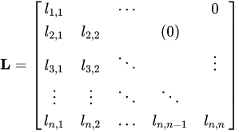
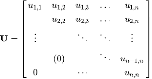

# 2-4. 特殊矩陣

* ## 記憶體存放

  **1. Row Major :** 

  **2. Col Major :**
  
  

## 1. 下三角矩陣 ( Lower triangular Matrix )

## 2. 上三角矩陣 ( Upper triangular Matrix )

## 3. 對稱矩陣 ( Symmetric Matrix )  

## 4. 寬帶矩陣 ( Band Matrix ) 

* ### 以對角線 ( i , j ) 相減差距計算，| i - j | ，中間對角線為 0，旁邊慢慢遞增

## 5. 稀疏矩陣 ( Sparse Matrix )