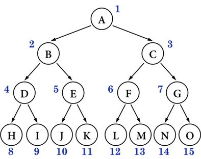
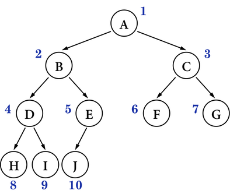
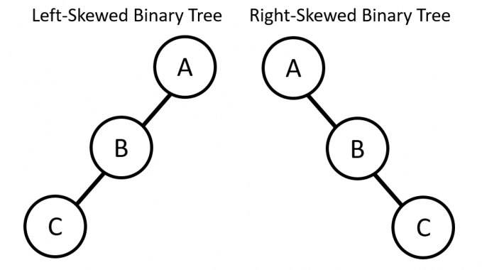

# 5-2 二元樹

## 二. 種類

* ## 1. 完滿二元樹 ( full binary tree ) 

  ### **定義** : depth-k 的二元樹，節點數為 $2^k-1$，即每個節點都有兩個孩子。

  

* ## 2. 完整二元樹 ( complete binary tree )

  ### **定義** : 每個節點依照**次序排列** (由上至下，由左至右)。

  

* ## 3. 歪斜二元樹 ( skew binary tree )

  ### (1)  **左**歪斜二元樹 : 每個 node 只有**左**子樹

  ### (2)  **右**歪斜二元樹 : 每個 node 只有**右**子樹

  

* ## 4. 嚴格二元樹 ( strictly binary tree )

  ### **定義** : 每個**非終端** node 都有**左右子樹**。

  

